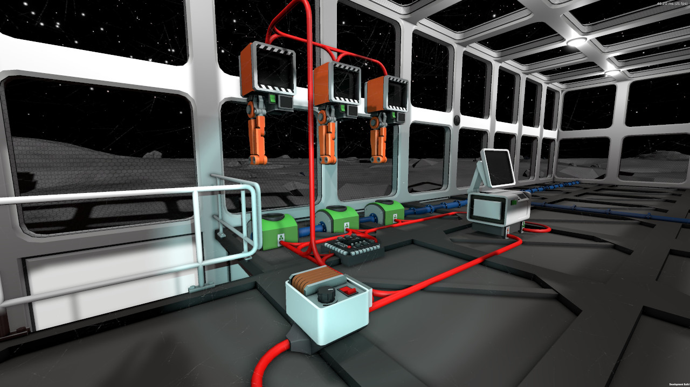

# Automate Your Food Production
To be honest: I hate the hunger and thirst mechanics in this game. I actually turned that crap off because it didn't do much but keeping me from extended mining trips. There's a challenge to be found in greenhouses, though, and I did accept that one.

The basic idea here is to use the automatic harvesters ("Harvies") along with the hydroponic trays to do some automation. As we obviously have to be connected to the tray as well as to the harvester and our beloved microcontroller has 6 GPIO pins, it's quite natural to build a setup with 3 growing stations per IC10 chip. This will typically look a bit like what you see here:

The code in the [microcontroller script](plantcontroller.mips) controls this setup. When a tray isn't occupied, a seed gets planted. When the plant is mature, it gets harvested. Quite simple.

After seeing a quite similar approach by somebody else in some Youtube video (sorry, I don't have a link) I also added a way to forbid planting. You can write a "1" to the IC housing itself and the Harvies won't start planting until you write a "0" again. This can be useful in combination with a separate chip that controls light, atmosphere and temperature and batch-writes ones to all the IC housings in your greenhouse if conditions are unsuitable. While this function is present in the code, I never bothered to build the hardware, though.