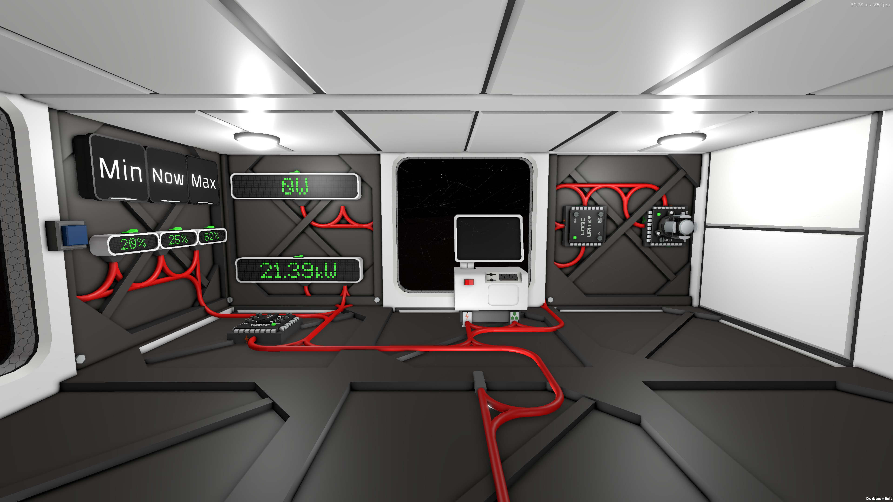
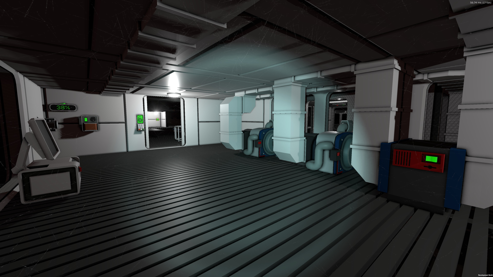

# Monitoring Power for Fun and Profit

## This Script and its Use
Any base worth its Stellite has a huge array of solar panels, a whole row of batteries and maybe some kind of generator setup. Most people, including me, start building this kind of stuff based on gut feeling, which is a problem. Too many batteries? They'll never get charged and you wasted ressources. Too many solar panels? When the batteries are full, energy is wasted. Getting this right without any kind of monitoring is rather impossible. This is why I built my power room:

The part that's controlled by the [IC10 script](powermonitor.mips) is to the left of the computer. The three small displays show information about the battery charge. The display in the middle tells us how much charge is in the batteries right now while the ones to the left and right display the smallest and the biggest charge ratio so far. The upper one of the big displays shows the amount of power being pushed into your batteries and the lower one shows the current power draw of the base. The button on the very left resets the minimum and maximum values.

How do you use this information? It's easy. Let your base run for a few day/night cycles and check the minimum and maximum charge values.

- If the minimum value is 0, you don't have enough batteries as the charge obviously ran out at some point in time.
- If the maximum value is 100, you may have to few batteries as they get fully loaded and power is wasted at some point in time.
- If your maximum value is significantly below 100, you don't have enough solar panels as the batteries never get full during the day.

I personally try to keep my maximum value somewhere around 90% with the minimum value somewhere around 20%. You may have different preferred values, but whatever they are - being able to actually monitor this is far easier than guessing.

If you change anything important, i.e. build new machines, batteries or panels, make sure to reset the min/max values and run a new test.

## Some More Fun With Power

On the right side of the picture, you may have spotted the logic writer and the transmitter. What does that part do?

The transmitter is an active one and it's named "batteryCharge". The logic writer has the small display in the middle as a data source and writes it to the "Setting" variable of the transmitter. Now I can access the current battery charge from anywhere, just by adding a passive transmitter to the network and reading its value. One can obviously use that to build battery charge displays across the base, but you might also want to control a backup power generator with this information!

The room in the screenshot is 14 levels below the control room and 50 metres to the side. The transmitter you can see on the left is passive and linked to the "batteryCharge" transmitter. The display shows the current battery charge for monitoring purposes. As soon as the charge drops below 20%, the generators are automatically activated and start feeding a total of 40MW into the batteries until 30% charge are reached and the generators turn off again.

Note that I did a bit of a dirty thing here. The output of the generators goes into my _batteries_ instead of augmenting the battery output, which is what one would normally expect. Yes, that can be done, but it requires a lot of fiddling with transformators and the additional power from the generator wouldn't show up on the "input power" display in my control room. My setup also guarantees that power from the generators will never be wasted as it always goes through the batteries.