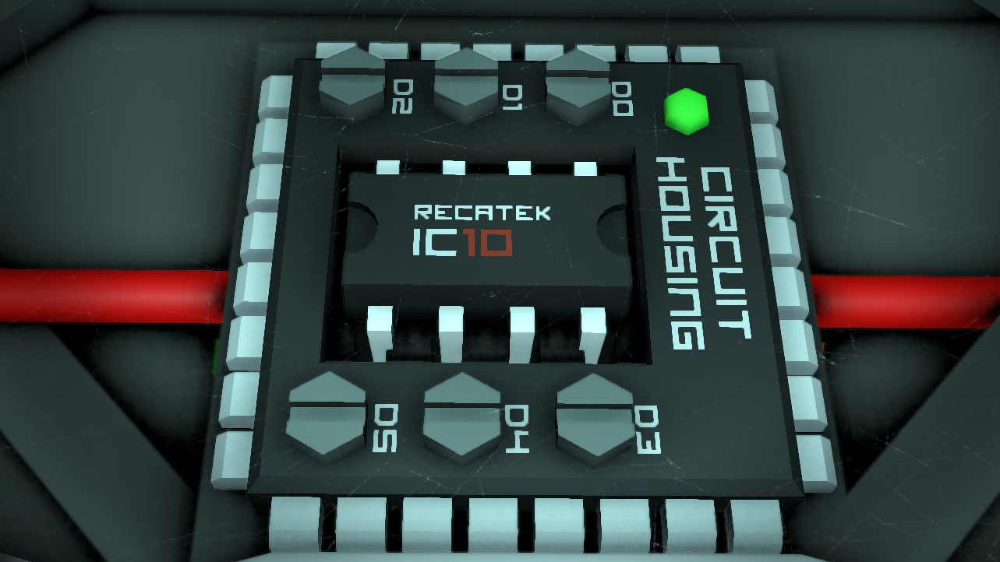

# Stationeers Automation Scripts

## What is This Stuff?

I really love the video game [Stationeers](https://store.steampowered.com/app/544550/Stationeers/) and I play it a lot. One of the great features of this game is being able to automate stuff in the space base you're building. When I say "automation", I mean "program some virtual microcontroller in MIPS assembly", which is probably the single coolest thing I've ever done in a video game.

This repository contains a collection of scripts that I created in the game. It might be more typical for a game to publish stiff like this on the Steam Workshop, but hell... It's program code. It needs to be under version control. It must be on Github. And besides that, the function for publishing scripts to the Workshop in-game is totally broken and I couldn't be bothered to look for a solution.

## What Have We Got?

At this time, we have the following very nice things here:

- The [Temperature Controller](https://github.com/Zappes/Stationeers/tree/main/Temperature%20Controller) makes sure that the temperature inside your base or greenhouse is what you want it to be.
- The [Plant Controller](https://github.com/Zappes/Stationeers/tree/main/Plant%20Controller) automates your hydroponic devices and harvies. Never return to your base again just to find out that you forgot the plants!
- The [Power Monitor](https://github.com/Zappes/Stationeers/tree/main/Power%20Monitor) lets you know the charging state of your batteries so you can optimize your power grid.
- The [Silo Controller](https://github.com/Zappes/Stationeers/tree/main/Silo%20Controller) can be attached to a storage silo and will help you build that fully automated warehouse you always wanted to have for ores or ingots or whatever you're collecting in an obsessive way.

## Join the ZwergArmy!

I created the scripts in this repository for the Zwergtube community. You don't know that? Have a look at this guy's Twitch and Youtube channel. Well, if you are willing to watch great stuff in German. There's no English content there, sorry.

- [Zwergtube on Youtube](https://www.youtube.com/user/MrZwergTube)
- [Zwergtube on Twitch](https://www.twitch.tv/zwergtube)
- [Zwergtube's web site](https://zwergtube.de/)

