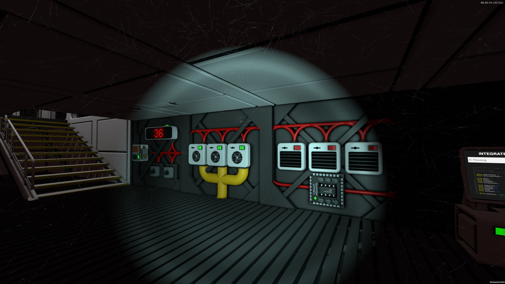

# Thermal Stability for Greenhouses and Other Stuff
Space can be cold. It can be hot as hell, too. Generally speaking, temperatures in space are uncomfortable, and any self-respecting stationeer wants a cozy home. So we should control our temperature, right?

My wish here was to create a firmware for the IC10 that could control an arbitrary number of heaters and coolers as I wanted to use the script for my rather large (10x5x3) greenhouse as well as for smaller buildings. Obviously those setup would require a different number of heaters and coolers - and what I wanted for my greenhouse surely would exceed the number of GPIO pins on the chip:

Six devices, a display, a sensor, two dials... I'm happy that batch writing in IC10 assembly is a thing. The script will use this highly helpful feature to turn heaters and coolers off, so the chip will always take over _all_ heaterss and coolers on the same network as the chip. See that transformer to the very left of the picture? Right, that's there to make sure that no unintended things happen. You can theoretically put as many heaters and coolers on that network, but keep in mind that a heater will draw 1100W of power, so you'll need appropriate cabling for larger installations.

Speaking of a sensor: The setup requires a gas sensor on the network. It's not shown because I put it in the main growing area one level above, and that's exactly what you should do if you decide to build something similar.

You can either just use the default temperature and hysteresis settings (20°C and 5) or use two dials to set those values up. The algorithm is quite simple - I'll only describe it for heaters, but it's basically the same thing for coolers:

- The current temperature, target temperature and hysteresis are read from the sensor and the dials. Or set from the default values if no dials are there.
- If the current temperature is between the target and target-hysteresis, do nothing. If your target is 20°C and your hysteresis is 5, this means that no change is made to the heaters while the temperature is between 15° and 20°.
- If the current temperature is above the target, all heaters are turned off.
- If the current temperature is lower than target-hysteresis, all heaters are turned on.

The hysteresis is there to avoid situations in which your heaters/coolers are flickering on and off like crazy when the temperature is floating around the target. It's like a dead zone on an analog joystick that makes sure you're not wiggling around when the stick is close to it's zero position.